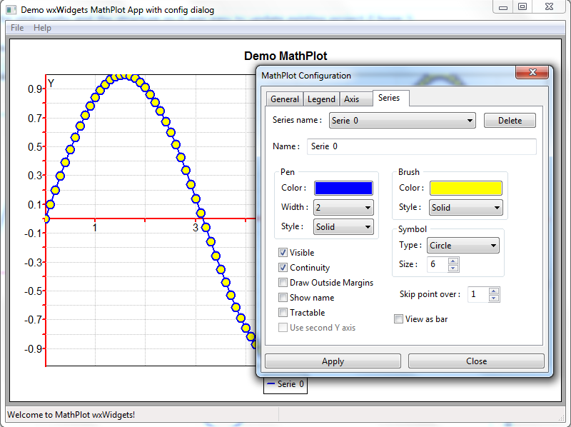

# wxMathPlot

I have updated the mathplot component for wxWidgets 3.2.1.
I have made some improvements like :
- corrected some bugs (and probably add others lol )
- rewrote some methods
- added a config window (that you can have access with the right click)
- add "view as bar" for XY functions
- view fullscreen if plot is in a single frame
- add in the demo the samples of the original project
- lot of things ... 
I keep the philosophy and the structure so it was easy to update existing project (I hope !).

  

Enjoy
Lionel
