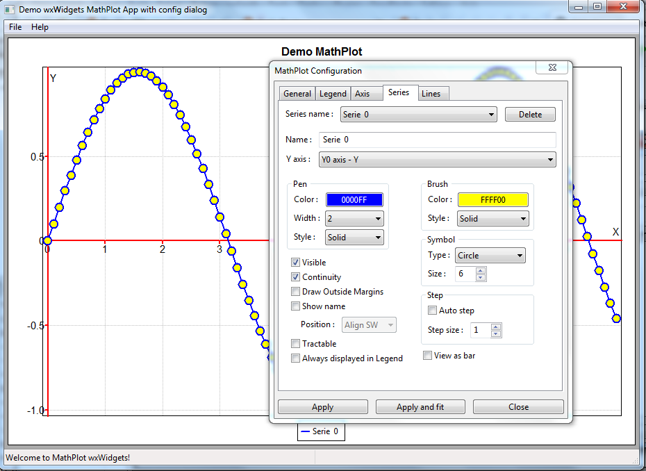
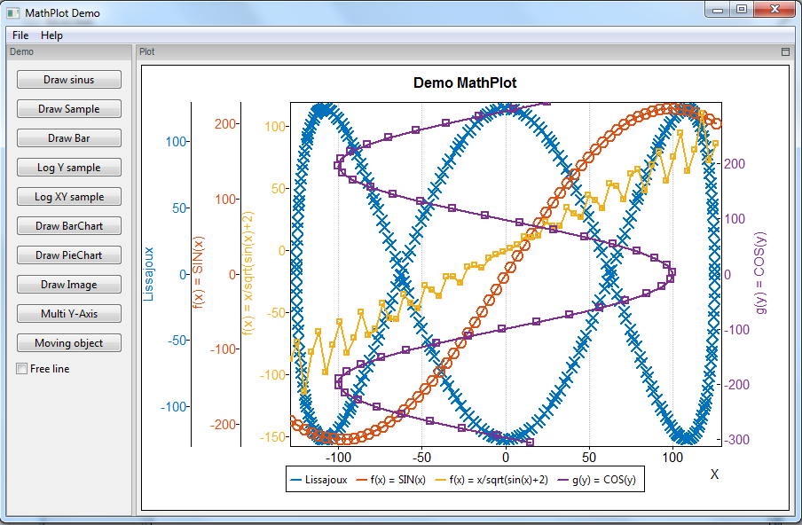

# wxMathPlot

Updated MathPlot component for wxWidgets 3.2.2 (also works with latest 3.3.x).  
I have made some improvements like:
- corrected some bugs (and added others lol)
- works on Linux
- added a config window (that you can have access with the right click) - makes it easy to enable/disable plots, change colors, etc. Need **MP_ENABLE_CONFIG** directive to active it
- added "view as bar" for XY functions
- added horizontal and vertical line
- added multiple Y axis management (unlimited number of Y-axis supported), including easy mouse interaction (zoom/pan) with each Y-axis. Thanks to Oskar Waldemarsson for this great work
- added log axis
- view fullscreen if plot is in a single frame
- added to demo the samples from the original project
- lot of things ... 
I keep the philosophy and the structure so it was easy to update existing project (I hope !).

Please note configuration (build) symbols you may want to  define:
- **MP_ENABLE_NAMESPACE** place all MathPlot components in the MathPlot namespace (default places everything in global namespace)
- **MP_ENABLE_CONFIG** enables Lionel's advanced configuration dialog (default is old behavior)

Documentation generated by GitHub: <a href="https://githublionel.github.io/wxMathPlot/" target="_blank">https://githublionel.github.io/wxMathPlot/</a>

Example showing new advanced configuration dialog: 

 

Enjoy 
Lionel
